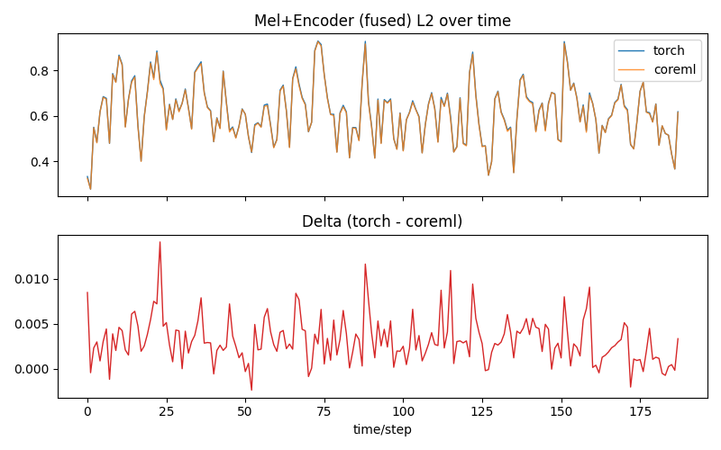
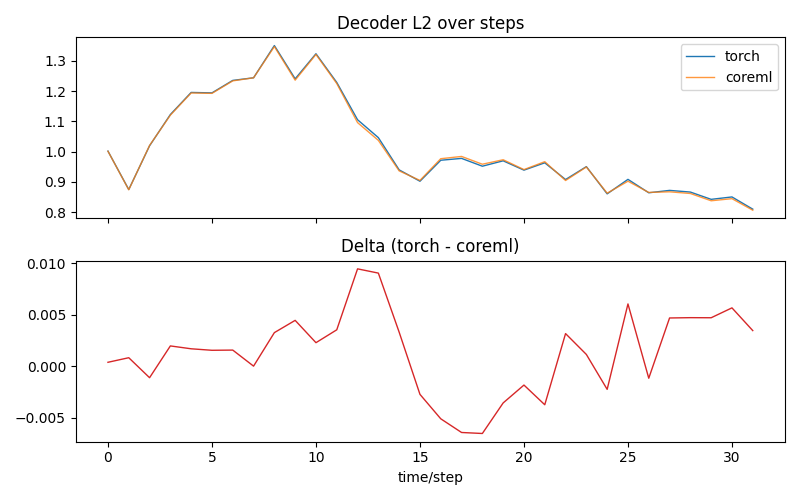
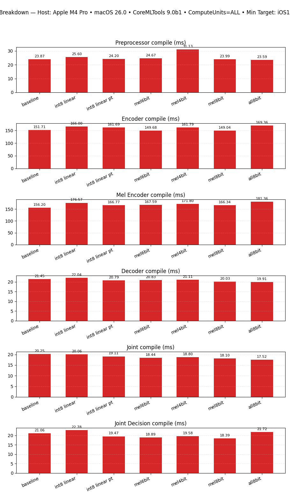
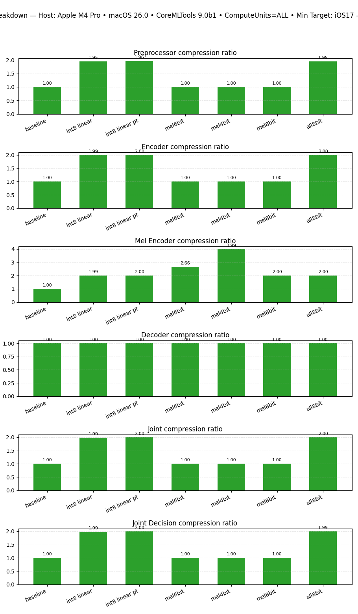
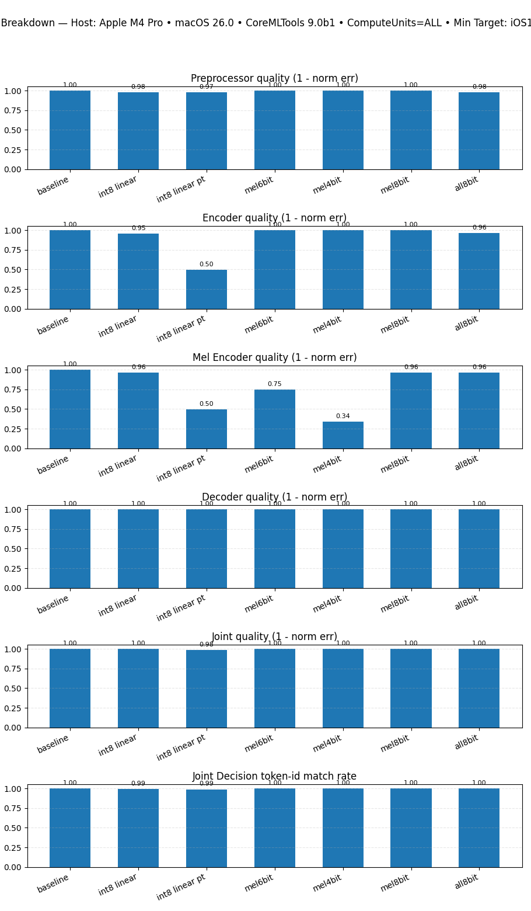

# Parakeet‑TDT v3 (0.6B) — CoreML Export, Parity, and Quantization

Tools to export NVIDIA Parakeet‑TDT v3 (0.6B) RNNT ASR to CoreML, validate numerical parity with the NeMo reference, measure latency, and explore quantization trade‑offs. All CoreML components use a fixed 15‑second audio window for export and validation.

## Environment

1. Create or reuse the local environment with `uv venv`.
2. Activate the repo `.venv` and install deps via `uv pip sync`.
3. Run everything through `uv run` to keep resolutions reproducible.

## Test Environment

All tests and measurements referenced here were run on an Apple M4 Pro with 48 GB of RAM.

## Export CoreML packages

Exports preprocessor, encoder, decoder, joint, and two fused variants (mel+encoder, joint+decision). Shapes and I/O match the fixed 15‑second window contract.

```
uv run python convert-parakeet.py convert \
  --nemo-path /path/to/parakeet-tdt-0.6b-v3.nemo \
  --output-dir parakeet_coreml
```

Notes
- Minimum deployment target: iOS 17. Compute units default to `ALL` in saved metadata.
- Audio is 16 kHz, single‑channel. The 15 s window is enforced during export and validation.

## Validate parity and speed (Torch vs CoreML)

Runs Torch and CoreML side‑by‑side on the same 15 s input, records diffs and latency, and saves plots under `plots/compare-components/`. The tool updates `parakeet_coreml/metadata.json` with all measurements.

```
uv run python compare-components.py compare \
  --output-dir parakeet_coreml \
  --model-id nvidia/parakeet-tdt-0.6b-v3 \
  --runs 10 --warmup 3
```

Output comparison:




Latency:





Quants:


### Key results (quality first)

Numerical parity is strong across components on the fixed window:
- Preprocessor mel: match=true; max_abs≈0.484, max_rel≈2.00 (near‑zero bins inflate relative error).
- Encoder: match=true; max_abs≈0.0054, strong agreement over time (see plot).
- Decoder h/c state: match=true; value deltas within tolerance.
- Joint logits: match=true; max_abs≈0.099, distributions align (see top‑k plot).
- Joint+Decision: Fused CoreML head exactly matches decisions computed on CoreML logits (token_id/prob/duration). PyTorch logits produce slightly different argmax paths (expected from small logit differences).

### Speed (latency and RTF)

Component latency on a 15 s clip, Torch CPU vs CoreML (CPU+NE) from `parakeet_coreml/metadata.json`:
- Encoder: Torch 1030.48 ms → CoreML 25.44 ms (≈40.5× faster, RTF 0.00170)
- Preprocessor: 1.99 ms → 1.19 ms (≈1.68×)
- Joint: 28.34 ms → 22.66 ms (≈1.25×)
- Decoder (U=1): 7.51 ms → 4.32 ms (≈1.73×)

Fused paths:
- Mel+Encoder (Torch separate vs CoreML fused): 1032.48 ms → 27.10 ms (≈38.1× faster)
- Joint+Decision (CoreML joint + CPU post vs fused CoreML head): 50.05 ms → 64.09 ms (fused is slower here; prefer CoreML joint + lightweight CPU decision on host).

Plots
- Latency bars and speedups: `plots/compare-components/latency_summary.png`, `plots/compare-components/latency_speedup.png`
- Fused vs separate: `plots/compare-components/latency_fused_vs_separate.png`, `plots/compare-components/latency_fused_speedup.png`
- Quality visuals: mel composite (`mel_composite.png`), encoder L2 over time (`encoder_time_l2.png`), decoder step L2 (`decoder_steps_l2.png`), joint top‑k/time L2 (`joint_top50.png`, `joint_time_l2.png`), joint‑decision agreement (`joint_decision_token_agree.png`, `joint_decision_prob_u0.png`).

## Quantization (size • quality • speed)

`uv run python quantize_coreml.py quantize` evaluates several variants and writes a roll‑up to `parakeet_coreml_quantized/quantization_summary.json`. Plots are mirrored to `plots/quantize/<compute_units>/` (we include `plots/quantize/all/`). Quality here is reported as 1 − normalized L2 error (1.0 = identical). For JointDecision we report token‑id match rate, duration match, and token‑prob MAE.

Quick highlights (ComputeUnits=ALL):
- int8 linear (per‑channel): ~2.0× smaller across components with minimal quality loss
  - MelEncoder quality≈0.963; latency≈31.13 ms (baseline≈29.34 ms)
  - JointDecision acc≈0.995; latency≈1.96 ms (baseline≈2.15 ms)
- int8 linear (per‑tensor symmetric): large encoder quality drop (≈0.50) — not recommended
- Mel palettization 8‑bit: MelEncoder quality≈0.961, ~2.0× size reduction; 6‑/4‑bit degrade quality more

Quantization plots (ALL)
- Fused: `plots/quantize/all/fused_quality.png`, `fused_latency.png`, `fused_compression.png`, `fused_size.png`
- Component breakdown: `plots/quantize/all/all_components_quality.png`, `all_components_latency.png`, `all_components_compression.png`, `all_components_size.png`, `all_components_compile.png`

## Reproduce the figures

1) Export baseline CoreML packages
```
uv run python convert-parakeet.py convert --model-id nvidia/parakeet-tdt-0.6b-v3 --output-dir parakeet_coreml
```

2) Compare Torch vs CoreML and generate parity/latency plots
```
uv run python compare-components.py compare --output-dir parakeet_coreml --runs 10 --warmup 3
```

3) Run quantization sweeps (mirrors plots into `plots/quantize/<compute_units>/`)
```
uv run python quantize_coreml.py quantize \
  --input-dir parakeet_coreml \
  --output-root parakeet_coreml_quantized \
  --compute-units ALL --runs 10
```

## Notes & limits

- Fixed 15‑second window shapes are required for all CoreML exports and validations.
- Latency measurements are host‑side CoreML predictions (CPU+NE or ALL); on‑device results can differ by chip/OS.
- For streaming decode, the exported decoder uses U=1 inputs with explicit LSTM state I/O.
- Minimum deployment target is iOS 17; models are saved as MLProgram and eligible for ANE with `ComputeUnits=ALL`.

## Acknowledgements

- Parakeet‑TDT v3 model from NVIDIA NeMo (`nvidia/parakeet-tdt-0.6b-v3`).
- This directory provides export/validation utilities and plots to help the community reproduce quality and performance on Apple devices.
