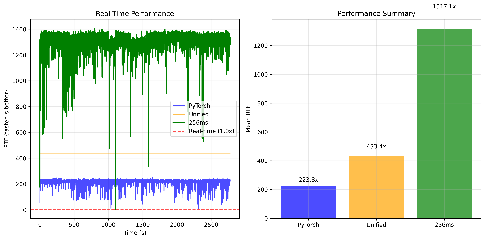

## Silero VAD CoreML

Checkpoint from this commit from [Silero-VAD](https://github.com/snakers4/silero-vad/tree/fba061dc5559f696e62171e9a0741782b0fdc23c)

CoreML conversion of Silero VAD models optimized for Apple Silicon devices with multiple deployment options.

Models are deployed on [Huggingface](https://huggingface.co/FluidInference/silero-vad-coreml)

## Model Variants

### 1. Modular Pipeline (3-stage)
- **STFT Model**: Converts audio to frequency domain
- **Encoder Model**: Feature extraction with 4-layer CNN
- **Decoder Model**: LSTM temporal modeling + final VAD probability

### 2. Unified Standard Model
- **Input**: 576 samples (16kHz, ~36ms total: 64 context + 512 current)
- **Output**: Single VAD probability [0.0-1.0]
- **Processing**: 32ms chunks with 64-sample context from previous chunk
- **LSTM State**: Persistent hidden/cell states for streaming inference

### 3. Unified 256ms Model
- **Input**: 4,160 samples (16kHz, 256ms) (64 context + 4096 current)
- **Output**: Single aggregated VAD probability [0.0-1.0]
- **Internal Processing**: Splits input into 8 chunks of 512 samples each, processes sequentially, returns maximum probability
- **Use Case**: Optimized for file processing and batch inference where speed matters more than real-time constraints

Noisy-OR is better than max because it avoids overreacting to a single spurious spike while still preserving sensitivity to brief speech. It is also better than averaging because it doesn’t wash out short bursts of speech across mostly silent chunks. By directly modeling the probability that any sub-chunk contains speech, it matches the semantics of VAD windows more faithfully.


## Why 256ms Processing?****

The 256ms model addresses a key trade-off in VAD deployment:

**Real-time Processing (32ms)**: Optimal for live audio streams but requires frequent model calls
**Batch Processing (256ms)**: 8x fewer model invocations with internal batching for significantly faster file processing

**Performance Benefits**:
- ~500x real-time factor vs ~300x for standard model
- Reduced inference overhead from fewer model calls
- Internal max aggregation provides robust VAD decisions over longer windows
- Maintains accuracy while dramatically improving throughput for non-real-time applications

**Internal Batching**: The model processes the 256ms input as 8 sequential 32ms chunks internally, maintaining LSTM state continuity and returning the maximum VAD probability across all chunks. This design preserves temporal dependencies while enabling efficient batch processing.

## Model Specifications

**All models require**:
- **Sample Rate**: 16kHz mono audio only
- **Stateful Processing**: LSTM states persist between chunks
- **Context Management**: Automatic handling of inter-chunk dependencies

## Installation and Setup

```bash
uv sync

```

Convert the models:

```bash
uv run python convert-coreml.py --output-dir ./silero-vad-coreml --include-256ms
```

Compare all the models against baseline and plot outputs

```bash
uv run python compare-models.py --audio-file ../FluidAudio/yc.wav  --include-256ms --output-dir  ./plots --coreml-dir ./silero-vad-coreml
```

## Benchmark against baseline model




**Citations**

```
@misc{Silero VAD,
  author = {Silero Team},
  title = {Silero VAD: pre-trained enterprise-grade Voice Activity Detector (VAD), Number Detector and Language Classifier},
  year = {2024},****
  publisher = {GitHub},
  journal = {GitHub repository},
  howpublished = {\url{https://github.com/snakers4/silero-vad}},
  commit = {insert_some_commit_here},
  email = {hello@silero.ai}
}
@misc{Silero VAD - Fluid Inference,
  author = {Fluid Inference},
  title = {Silero VAD CoreML},
  year = {2024},
  publisher = {GitHub},
  journal = {GitHub repository},
  howpublished = {\url{https://github.com/snakers4/silero-vad}},
  commit = {insert_some_commit_here},
  email = {hello@fluidinference.com}
}
```
